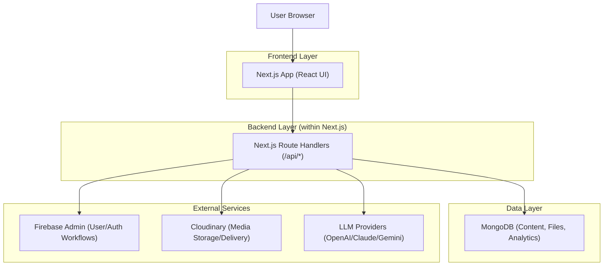
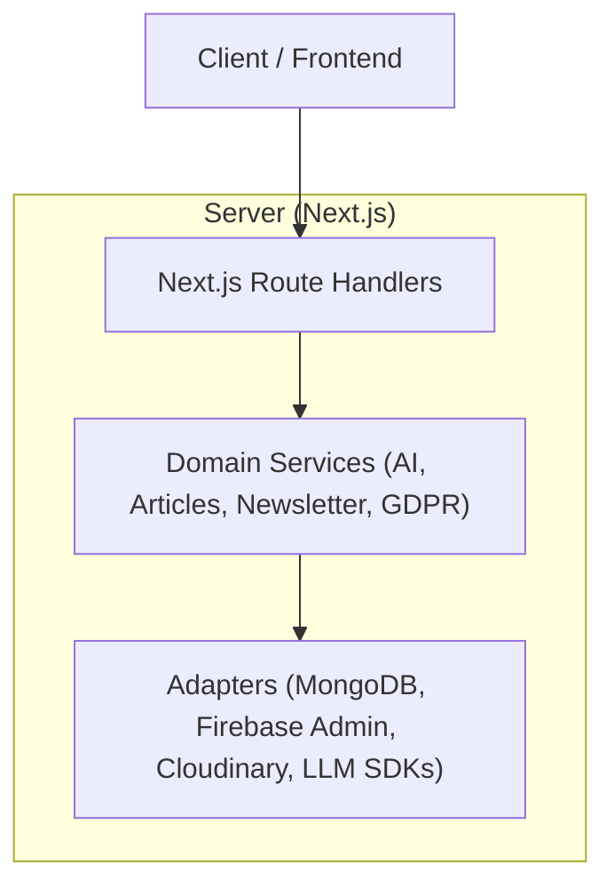
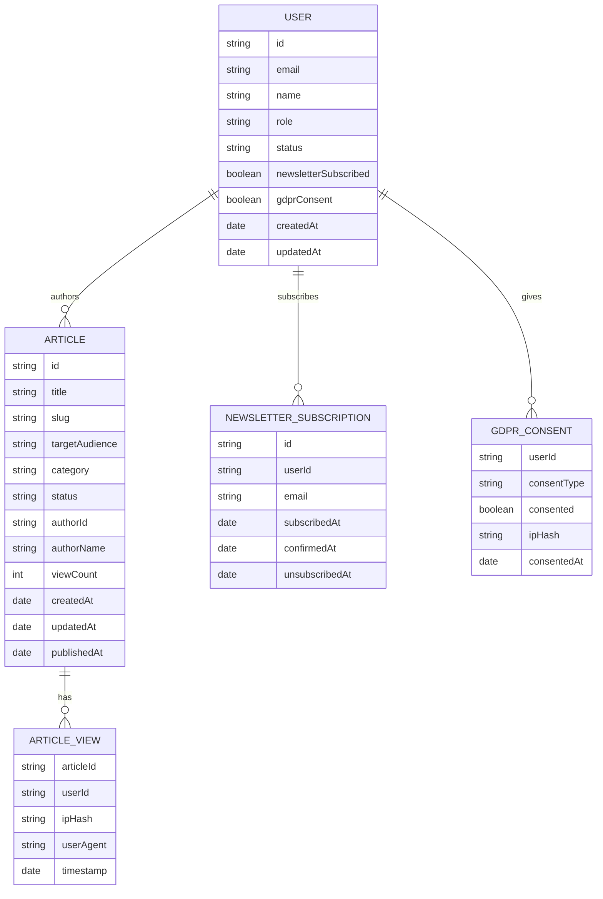

## 1.Architecture design


## 2.Technology Description
- Frontend: Next.js@14 (React@18) + Tailwind CSS@3 + lucide-react
- Backend: Next.js Route Handlers (App Router) for /api/*, plus middleware for security headers and rate limiting
- Database: MongoDB (via mongodb driver)
- Auth/Admin support: Firebase + firebase-admin
- Media: Cloudinary + next-cloudinary
- AI: openai + @anthropic-ai/sdk + @google/generative-ai

## 3.Route definitions
| Route | Purpose |
|-------|---------|
| / | Public landing page (patient/professional CTAs + content explainer sections) |
| /patient | Patient article list/browse |
| /patient/[slug] | Patient article detail |
| /patient/generate | Patient-facing generation/submission entry |
| /professional | Professional article list/browse |
| /professional/[slug] | Professional article detail |
| /login | Login |
| /register | Registration |
| /forgot-password | Password reset |
| /pending-approval | Status page for approval workflow |
| /dashboard | Editorial dashboard home |
| /dashboard/create | AI draft generation |
| /dashboard/articles | Manage articles |
| /dashboard/articles/[id] | Article edit/detail |
| /dashboard/settings | Dashboard settings |
| /admin | Admin home |
| /admin/users | User approvals/management |
| /admin/articles | Admin article management |
| /admin/analytics | Admin analytics/overview |
| /admin/settings | Admin settings |
| /privacy | Privacy policy |
| /terms | Terms |
| /cookies | Cookies policy |

## 4.API definitions (If it includes backend services)
### 4.1 Shared types (TypeScript)
- User, Article, SEOMeta, AIGenerationRequest/AIGenerationResponse, AnalyticsSummary, NewsletterSubscription, APIResponse

### 4.2 Core API (selected)
- GET /api/health
- GET /api/public-config
- GET /api/articles
- GET /api/articles/[id]
- GET /api/search
- POST /api/ai/generate
- POST /api/images/generate
- POST /api/seo/optimize
- POST /api/newsletter/subscribe
- POST /api/newsletter/unsubscribe
- POST /api/patient/submit
- POST /api/gdpr/consent
- POST /api/gdpr/export
- POST /api/gdpr/delete
- GET /api/files/[id]
- GET /api/admin/overview
- GET /api/admin/users/list
- POST /api/admin/users/approve
- POST /api/admin/users/reject
- POST /api/admin/users/delete
- GET /api/export/patient-articles

## 5.Server architecture diagram (If it includes backend services)


## 6.Data model(if applicable)
### 6.1 Data model definition


### 6.2 Data Definition Language
MongoDB collections (logical): users, articles, articleViews, newsletterSubscriptions, gdprConsents, files

Example index setup (Mongo shell style):
```js
// articles
db.articles.createIndex({ slug: 1, targetAudience: 1 }, { unique: true })
db.articles.createIndex({ status: 1, targetAudience: 1, publishedAt: -1 })
db.articles.createIndex({ category: 1, targetAudience: 1 })

// users
db.users.createIndex({ email: 1 }, { unique: true })
db.users.createIndex({ status: 1, role: 1, createdAt: -1 })

// analytics
db.articleViews.createIndex({ articleId